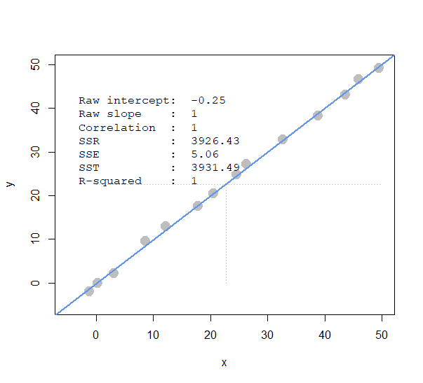
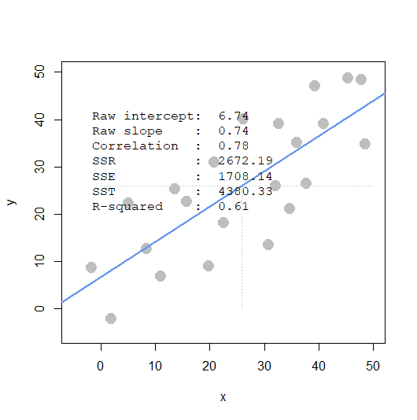
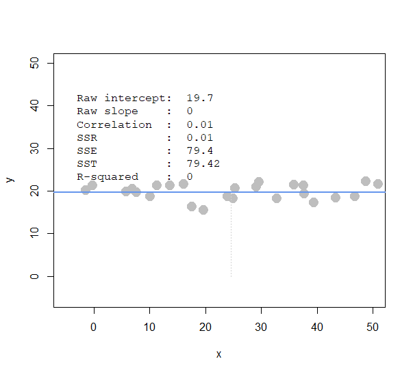
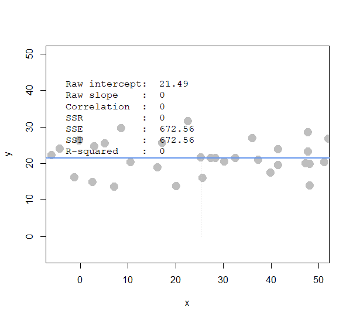
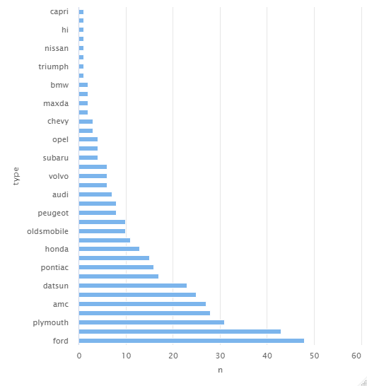
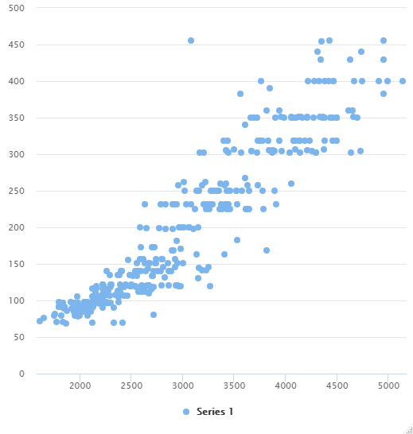
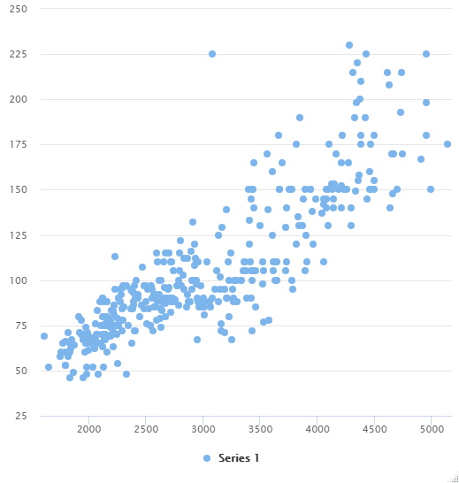
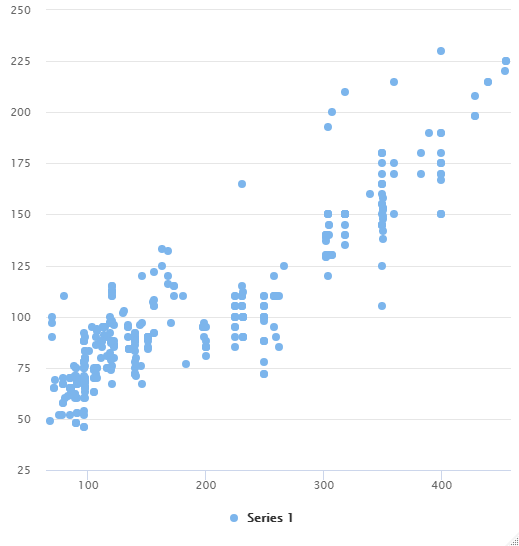

```{r setup, include=FALSE}
knitr::opts_chunk$set(echo = TRUE)
```

# BACS HW - Week 9

------------------------------------------------------------------------

## Prerequisite

```{r message=FALSE, warning=FALSE}
library(dplyr)
library(ggplot2)
library(reshape2)
library(ggcorrplot)
library(highcharter)
library(webshot)
```

------------------------------------------------------------------------

## Question 1) Simulate each scenarios.

| Scenarios      | Explaination                                                                      |
|----------------|-----------------------------------------------------------------------------------|
| **Scenario 1** | ***a very narrowly dispersed set of points (negative / positive steep slope)***   |
| **Scenario 2** | ***a widely dispersed set of points (negative / positive steep slope)***          |
| **Scenario 3** | ***a very narrowly dispersed set of points (negative / positive shallow slope)*** |
| **Scenario 4** | ***a widely dispersed set of points (negative or positive shallow slope)***       |

: Four Scenarios









> ### a. Comparing scenarios 1 and 2, which do we expect to have a stronger R2 ?
>
> > **Ans.** I expect the first scenario (1) to have a stronger $R^2$ value.
>
> ### b. Comparing scenarios 3 and 4, which do we expect to have a stronger R2 ?
>
> > **Ans.** I expect the former scenario (3) to have a stronger $R^2$ value.
>
> ### c. Comparing scenarios 1 and 2, which do we expect has bigger/smaller SSE, SSR, and SST?
>
> > |         |                            |                        |
> > |---------|----------------------------|------------------------|
> > | **SSE** | sum of squares' error      | $y$, ${\bar y}$        |
> > | **SSR** | sum of squares' regression | ${\hat y}$, ${\bar y}$ |
> > | **SST** | sum of squares' total.     | $y$, ${\hat y}$        |
> >
> > : Variations
> >
> > **Ans.** I expect the first scenario to have a smaller SSE; while plot1 has a steeper slope than plot2, I would also assume that the former plot has a larger SSR value. Last but not least, points on plot1 falls almost exactly on the estimated regression line, as a result I would expect plot1 to have a smaller value of SST.
>
> ### d. Comparing scenarios 3 and 4, which do we expect has bigger/smaller SSE, SSR, and SST? (intuitively)
>
> > **Ans.** As we can observe from the plots, both of their estimated regression line lie on the means. As we can observe from the above table, we can easily conclude that SSR values on both plots are expected to be 0. Therefore, in this case, the SSE value is equal to SST value, which is observed to be larger in plot4.

------------------------------------------------------------------------

## Question 2) Regression

### Prerequisite

```{r}
dataset = read.csv('programmer_salaries.txt', sep='\t')
knitr::kable(head(dataset))
plot(dataset)
```

> ### a. Estimate the model `Salary ~ Experience + Score + Degree`
>
> -   ${\beta}$
>
> -   $R^2$
>
> -   Top 5 values of ${\hat y}$ and ${\epsilon}$
>
> ```{r}
> # Raw data regression
> summary(lm(Salary~Experience+Score+Degree, data=dataset))
> ```
>
> -   <div>
>
>     -   $β_0$: If the first variable has no value, how much of variable2 will it be? (intercept)
>
>     -   $β_1$: How much of the covariance of v1 and v2 is explained by the variance of v1? (slope)
>
>     -   In this case, $R^2 = 0.8468$
>
>     </div>
>
> ```{r}
> summary(lm(Salary~Experience+Score+Degree, data=data.frame(scale(dataset))))
> ```
>
> -   <div>
>
>     -   After standardizing the data, $R^2$ remains the same.
>
>     -   $R^2 = 0.8468$
>
>     </div>
>
> ```{r}
> lm(Salary~Experience+Score+Degree, data=dataset)$fitted.values[1:5]
> lm(Salary~Experience+Score+Degree, data=dataset)$residuals[1:5]
> ```
>
> **Note.** $R$ is the coefficient of multiple correlation between dependent variable and all independent variables, and $R^2$ is the coefficient of determination.
>
> ### b. Use `linear algebra` and the `geometric view of regression` to estimate the regression.
>
> -   ***i.*** Create an **X** matrix that has a first column of `1s` followed by columns of the independent variables.
>
>     ```{r}
>     ones <- rep(1, length(dataset$Experience))
>     X <- matrix(c(ones, dataset$Experience, dataset$Score, dataset$Degree),
>                 ncol=4,
>                 nrow=length(ones),
>                 byrow=FALSE)
>     >
>     colnames(X) <- c("1","exp","score","degree")
>     dim(X)
>     knitr::kable(head(X))
>     ```
>
> -   ***ii.*** Create a `y` vector with the Salary values.
>
> ```{r}
> y <- as.matrix(dataset$Salary)
> dim(y)
> ```
>
> -   ***iii.*** Compute the ${\hat\beta}$ vector of estimated regression coefficients.
>
> ```{r}
> beta_hat <- solve(t(X)%*%X)%*%t(X)%*%y
> dim(beta_hat)
> print(beta_hat)
> ```
>
> -   ***iv.*** Compute a ${\hat y}$ vector of estimated $y$ values, and a ${\epsilon}$ vector of residuals 
>
> ```{r}
> y_hat <- X %*% beta_hat
> dim(y_hat)
> print(y_hat[1:5,])
> residual <- y - y_hat
> print(residual[1:5,])
> ```
>
> -   ***v.*** Using only the results from ***(i) -- (iv)***, compute `SSR`, `SSE` and `SST`.
>
> ```{r}
> variations <- function(y, y_hat){
>   y_mean = mean(y)
>   
>   stat <- list()
>   stat$R_squared <- cor(y, y_hat)^2
>   stat$SSR <- sum((y_hat-y_mean)^2)
>   stat$SSE <- sum((y-y_hat)^2)
>   stat$SST <- sum((y-y_mean)^2)
>   
>   return(stat)
> }
> >
> model_fit <- variations(y, y_hat)
> round(model_fit$SSR+model_fit$SSE, 2) == round(model_fit$SST, 2)
> print(model_fit)
> ```
>
> ### c. Compute $R^2$ for in two ways, and confirm you get the same results.
>
> -   ***i.***
>
> ```{r}
> R_squared_i <- 1-model_fit$SSE/model_fit$SST
> ```
>
> -   ***ii.***
>
> ```{r}
> R_squared_ii <- model_fit$R_squared
> ```
>
> ```{r}
> # Comparison
> round(R_squared_i, 2) == round(R_squared_ii, 2)
> print(c(R_squared_i, R_squared_ii))
> ```

------------------------------------------------------------------------

## Question 3) Early heady days of global car manufacturing, we are interested in explaining what kind of cars have higher fuel efficiency (mpg).

+-------+--------------+-----------------------------+
| **1** | mpg          | miles-per-gallon            |
+-------+--------------+-----------------------------+
| **2** | cylinders    | cylinders in engine         |
+-------+--------------+-----------------------------+
| **3** | displacement | size of engine              |
+-------+--------------+-----------------------------+
| **4** | horsepower   | power of engine             |
+-------+--------------+-----------------------------+
| **5** | weight       | weight of car               |
+-------+--------------+-----------------------------+
| **6** | acceleration | acceleration ability of car |
+-------+--------------+-----------------------------+
| **7** | model_year   | year model was released     |
+-------+--------------+-----------------------------+
| **8** | origin       | place car was designed      |
|       |              |                             |
|       |              | (1: USA, 2: EU, 3. Japan)   |
+-------+--------------+-----------------------------+
| **9** | car_name     | make and model names        |
+-------+--------------+-----------------------------+

: auto-data.txt

### Prerequisite

```{r}
auto <- read.table("auto-data.txt", header=FALSE, na.strings = "?")
names(auto) <- c("mpg", "cylinders", "displacement", "horsepower", "weight", 
                 "acceleration", "model_year", "origin", "car_name")
auto = auto[complete.cases(auto),]
```

> ### a. Exploring the data.
>
> -   ***i.*** Visualize the data.
>
>     I create a `type` variable using `car_names`.
>
> ```{r}
> type=""
> for (name in auto$car_name){
>   type = c(type, strsplit(name, split = " ")[[1]][1])
> }
> auto$type = type[-1]
> >
> # Trying to plot linear relationship between variabes
> plt <- function(a, b){
> ggplot(auto, aes(x=a, y=b))+
>   geom_point()+
>   stat_smooth(method='lm')+
>     labs(x='', y='')
> }
> ```
>
> -   <div>
>
>     -   Origin counts
>
>         ```{r}
>         ggplot(data=auto) + 
>           geom_bar(mapping=aes(x=origin,fill=factor(origin)))
>         ```
>
>     Most of the cars are made from the United States.
>
>     -   Type counts
>
>         ```{r test, message=FALSE, warning=FALSE}
>         #auto %>% 
>           #count(type) %>%
>           #arrange(n) %>%
>           #hchart(type="bar", hcaes(x=type, y=n))
>         ```
>
>     
>
>     Most of the vehicles are produced by "Ford."
>
>     -   Weight vs. Displacement
>
>         ```{r message=FALSE, warning=FALSE}
>         #highchart()%>%
>           #hc_add_series(auto, "scatter", hcaes(x=weight, y=displacement))
>         >
>         plt(auto$weight, auto$displacement)
>         ```
>
>     
>
>     The heavier engine tends to have a larger size.
>
>     -   Weight vs. Horsepower
>
>         ```{r message=FALSE, warning=FALSE}
>         #highchart()%>%
>           #hc_add_series(auto, "scatter", hcaes(x=weight, y=horsepower))
>         >
>         plt(auto$weight, auto$horsepower)
>         ```
>
>     
>
>     The heavier the engine, the more power it produced. (COOL!)
>
>     -   Displacement vs. Horsepower
>
>         ```{r message=FALSE, warning=FALSE}
>         #highchart()%>%
>           #hc_add_series(auto, "scatter", hcaes(x=displacement, y=horsepower))
>         >
>         plt(auto$displacement, auto$horsepower)
>         ```
>
>     
>
>     The larger the size of the car engine, the powerful it is. (COOL!)
>
>     -   Displacement vs. mpg vs. Model_year
>
>         ```{r warning=FALSE}
>         ggplot(data=auto)+
>           aes(x = displacement, y=mpg, color=type)+
>           geom_point()+
>           facet_wrap(.~model_year)
>         ```
>
>     The larger the engine size, the higher fuel efficiency the car.
>
>     </div>
>
> <!-- -->
>
> -   ***ii.*** Report a correlation table of all variables, rounding to two decimal places.
>
> ```{r}
> auto <- read.table("auto-data.txt", header=FALSE, na.strings = "?")
> >
> names(auto) <- c("mpg", "cylinders", "displacement", "horsepower", "weight",
>                  "acceleration", "model_year", "origin", "car_name")
> >
> cormat <- round(cor(auto[,1:8], use="pairwise.complete.obs"), 2)
> #View(cormat)
> knitr::kable(cormat)
> >
> melted_cormat <- melt(cormat)
> knitr::kable(head(melted_cormat))
> >
> ggplot(data = melted_cormat, aes(x=Var1, y=Var2, fill=value)) + 
>   geom_tile()+ggtitle('HeatMap')
> ```
>
> -   ***iii.*** Which variables seem to relate to mpg?
>
> **Ans.** According to the visualization and the correlation matrix, I think cylinders, displacement, horsepower and weight have a negative correlation respectively with mpg.
>
> -   ***iv.*** Which relationships might not be linear?
>
> **Ans.** By observing the heatmap presented above, I think **`origin` & `acceleration`**, **`origin` & `model_year`**, **`acceleration` & `model_year`** are the least likely pairs of variables to have a linear relationship due to their correlation values (0.21, 0.18, 0.29)
>
> ```{r warning=FALSE, message=FALSE}
> # Verify
> plt(auto$acceleration, auto$origin)
> >
> plt(auto$model_year, auto$origin)
> >
> plt(auto$model_year, auto$acceleration)
> ```
>
> -   ***v.*** Are there any pairs of independent variables that are highly correlated $r > 0.7$ ?
>
> **Ans.** Yes.
>
> ```{r}
> cordf <- as.data.frame(cormat)
> cormat[cormat<=0.7|cormat==1] <- ''
> knitr::kable(head(cormat))
> >
> ggcorrplot(cordf, hc.order = TRUE, type = "lower",lab = TRUE)
> ```
>
> As we can observe from the plot above, `displacement` has a highly positive correlation with `cylinders`, `weight` and `horsepower`; `cylinders` has a highly positive correlation with `weight`; while weight has a highly positive correlation with `horsepower`.
>
> **Note.** mpg has a highly negative correlation with displacement, cylinders, weight and horsepower.
>
> ### b. Create a linear regression model where `mpg` is dependent upon all other suitable variables.
>
> -   ***i.*** Which independent variables have a ***significant*** relationship with mpg at 1% significance?
>
> ```{r}
> summary(lm(mpg~cylinders+
>              displacement+
>              horsepower+
>              weight+
>              acceleration+
>              model_year+
>              factor(origin), data=auto[1:8]))
> ```
>
> **Ans.** cylinders, horsepower and acceleration.
>
> -   ***ii.*** Is it possible to determine which independent variables are the most effective at increasing mpg? If so, which ones, and if not, why not?
>
> **Ans.** We can not rely on the above results to draw conclusion about which variables have the most power to make an effect at `mpg`. Hence, no, before standardizing the data, we are getting results that measure slopes, intercepts by different units. Comparing values based on different units is meaningless.
>
> ### c. Resolve some of the issues with our regression model above.
>
> -   ***i.*** Create fully standardized regression results: are these slopes easier to compare?
>
> ```{r}
> summary(lm(mpg~cylinders+
>              displacement+
>              horsepower+
>              weight+
>              acceleration+
>              model_year, data=as.data.frame(scale(auto[1:7]))))
> ```
>
> **Ans.** Yes. Standardizing data allows data to be compared to each others in the same units. As we can observe from the results, by reducing `weights` of a vehicle, `mpg` would be able to increase effectively.
>
> -   ***ii.*** Regress `mpg` over each **nonsignificant** independent variable, individually.\
>     Which ones become significant when we regress mpg over them individually?
>
> ```{r}
> # weight
> summary(lm(mpg~weight, data=as.data.frame(auto[c('mpg','weight')])))
> # model_year
> summary(lm(mpg~model_year, data=as.data.frame(auto[c('mpg','model_year')])))
> ```
>
> **Ans.** Both of them become significant after regressing `mpg` over them.
>
> -   ***iii.*** Plot the density of the residuals: are they normally distributed and centered around zero?
>
> ```{r}
> regr <- lm(mpg~cylinders+
>              displacement+
>              horsepower+
>              weight+
>              acceleration+
>              model_year+
>              factor(origin), data=auto[1:8])$residuals
> ggplot()+
>   aes(regr)+
>   geom_density()+
>   ggtitle('Residual Density Plot')+
>   geom_vline(xintercept = 0, colour='red', lwd=1.2)+
>   geom_vline(xintercept = c(sd(regr), -sd(regr)), colour='red', alpha=0.3)
> >
> ggplot()+
>   aes(regr)+
>   geom_boxplot()
> ```
>
> **Ans.** Yes\~
