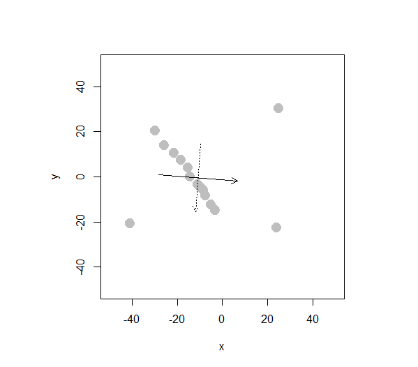

```{r setup, include=FALSE}
knitr::opts_chunk$set(echo = TRUE)
```

# BACS HW - Week 13

------------------------------------------------------------------------

## Prerequisite

```{r message=FALSE, warning=FALSE}
library(corrplot)
library(ggplot2)
library(ggbiplot)
library(grid)
library(factoextra)
library(tidyverse)
library(magrittr)
library(FactoMineR)
```

```{r message=FALSE, warning=FALSE}
cor_plt <- function(data){
  cor_data <- round(cor(data[, 1:length(data)], use='pairwise.complete.obs'), 3)
  corrplot.mixed(cor_data, tl.col='black', tl.pos='lt')
}

auto = read.table('data/auto-data.txt', header=FALSE, na.strings = '?')
names(auto) <- c("mpg", "cylinders", "displacement", "horsepower", "weight", 
                 "acceleration", "model_year", "origin", "car_name")
auto = as.data.frame(auto[complete.cases(auto),])

car_log = with(auto, data.frame(log(mpg),
                                log(cylinders),
                                log(displacement),
                                log(horsepower),
                                log(weight),
                                log(acceleration),
                                model_year,
                                origin))
car_log = as.data.frame(car_log[complete.cases(car_log),])
cor_plt(car_log)
```

------------------------------------------------------------------------

## PCA

-   **Note.** PCA, principal component analysis is a dimensionality reduction method often used to reduce the dimensionalty of large data sets, by transforming a large set of variables into a smaller one that still contains most of the information in the large set.

-   Reducing the number of variables of a data set naturally comes at the expense of accuracy, but the trick in dimentionality reduction is to trade a little accuracy for simplicity!

-   Smaller data sets are easier to explore, compute and visualize that makes analyzing data much faster and easier without extraneous variables to process.

-   To conclude in short, the idea of PCA is to reduce the number of variables of a data set, while preserving as much information as possible.

------------------------------------------------------------------------

## Question 1) Principal Component Analysis

> ### a. Analyze the principal components of the four collinear variables.
>
> **(cylinders, displacement, horsepower, and weight)**
>
> -   ***i.*** Create a new data frame of the four log-transformed variables with high multicollinearity.

```{r}
high_corr_variables = with(car_log, data.frame(log.cylinders.,
                                               log.displacement.,
                                               log.horsepower.,
                                               log.weight.)
)
knitr::kable(head(high_corr_variables))
plot(high_corr_variables)
```

> -   ***ii.*** How much variance of the four variables is explained by their first principal component?

```{r message=FALSE, warning=FALSE}
# Principal component of this "high_corr_variables" are the eigenvectors of its covariance matrix
head(cov(high_corr_variables))
head(cor(high_corr_variables))
cor_plt(high_corr_variables)
```

> -   **Concept:** Recall that covariance matrix calculates the similarities between the variables using dot product, while correlation matrix uses the standardized dot product, in other words, correlation matrix can be interpreted as a standardized version of covariance matrix.

```{r message=FALSE, warning=FALSE}
eigen_vectors =eigen(cov(high_corr_variables))$vectors # eigen vectors of covariance of high_corr_variables
colnames(eigen_vectors) = c('PC1', 'PC2', 'PC3', 'PC4')
row.names(eigen_vectors) = names(high_corr_variables)
knitr::kable(head(eigen_vectors))

eigen_values = eigen(cov(high_corr_variables))$values # eigen values of covariance of high_corr_variables
eigen_values

# confirm with principle components analysis
high_corr_var_pca = prcomp(high_corr_variables)
summary(high_corr_var_pca)
```

> -   ***iii.*** What would you call the information captured by the first principal component?

```{r warning=FALSE, message=FALSE}
high_corr_var_pca$center
# square roots of the eigenvalues of the covariace matrix
high_corr_var_pca$sdev 
# verify with the eigenvalues we calculated
sqrt(eigen_values)
# x returns the centered data multiply by the rotation matrix
Scores = high_corr_var_pca$x
fviz_pca_biplot(high_corr_var_pca)
```

> -   **Note.** The idea of principal component analysis is that it tries to put maximum possible information in the first components, then the maximum remaining information in the second and so on, until having something like shown in the scree plot below.

```{r message=FALSE, warning=FALSE}
fit <- high_corr_variables %>% scale()
res.pca = PCA(fit, graph=FALSE)
fviz_eig(res.pca, addlabels=TRUE)
fviz_pca_var(res.pca, col.var = "cos2",
             gradient.cols = c("#00AFBB", "#E7B800", "#FC4E07"), 
             repel = TRUE)
```

> -   
>
>     -   **Note.** Organizing information in PC this way will allow you to reduce dimensionality without losing much information by discarding the components with low information and considering the remaining components as your new variables.
>
>     -   Geometrically speaking, PC represents the directions of the data that explains a maximal amount of variance, in other words, the lines that capture most information of the data.
>
> ### b. Revisit our regression analysis on `car_log`.
>
> -   ***i.*** Store the scores of the first principal component as a new column of `cars_log`.

```{r}
car_log$scores <- Scores[,'PC1']
```

> -   ***ii.*** Regress `mpg`over the column with `PC1 scores` as well as `acceleration`, `model_year` and `origin`.

```{r message=FALSE, warning=FALSE}
summary(
  lm(log.mpg.~
       log.acceleration.+
       model_year+
       factor(origin)+
       scores,
     data=car_log)
)
```

> -   ***iii.*** Run the regression over the same independent variables with everything standardized.
>
>     How important is this new column relative to other columns?

```{r}
sapply(high_corr_variables, function(x) {max(x)-min(x)})
```

> -   **Note.** These four scales have different ranges. Since PCA is quite sensitive regarding the variances of the initial variables. Variables with larger ranges will dominate over those with small ranges, which will lead to biased results.

```{r}
high_corr_var_pca = prcomp(high_corr_variables, scale. = TRUE)
Scores = high_corr_var_pca$x
car_log$scores <- Scores[,'PC1']

summary(
  lm(scale(log.mpg.)~
       scale(log.acceleration.)+
       scale(model_year)+
       factor(origin)+
       scores,
     data=car_log
  )
)
```

> -   **Ans.** Variables are now transformed into same scale, and column scores is very significant relative to the other columns.

------------------------------------------------------------------------

## Question 2) Analyze the principal components of the eighteen items from the excel data file `security_questions.xlsx`.

> ### a. How much variance did each extracted factor explain?

```{r}
questions <- readxl::read_excel('data/security_questions.xlsx',
                                        sheet=1,
                                        col_names = c('Question', 'Description'))
responds <- readxl::read_excel('data/security_questions.xlsx',
                              sheet=2,
                              col_names = TRUE)

cov(responds)[1:5, 1:5]

sapply(responds, function(x){max(x)-min(x)})
# they are in the same scale -> no need of scaling
respond_pca <- prcomp(responds)
summary(respond_pca)
```

> ### b. How many dimensions would you retain, according to the two criteria we discussed?
>
> | **Criteria I**  | Eigenvalue ≥ 1                 |
> |-----------------|--------------------------------|
> | **Criteria II** | **Factors before the** $elbow$ |
>
> : Criteria

```{r message=FALSE, warning=FALSE}
respond_eigen <- eigen(cor(responds))
knitr::kable(head(respond_eigen$values))

ggbiplot(respond_pca, labels=rownames(respond_pca))
fviz_pca_biplot(respond_pca)
```

> **Ans.** According to the scree plot, the third PC does not lie before the *elbow*, despite the fact that it has an eigenvalue bigger than 1. Hence, I will choose only the first 2 PC's to retain in the model.

```{r message=FALSE, warning=FALSE}
res.pca <- PCA(responds)
fviz_eig(res.pca, addlabels=TRUE)
```

> ## c. Can you interpret what any of the principal components mean?
>
> ## Guess the meaning of the first two or three PCs.

```{r}
respond_eigen$values %>% subset(respond_eigen$values>=1)
summary(respond_pca)
```

> -   **Ans.** The first PC seems to give weights equally to every factor, while the second PC gives a larger weight to Q17 Q12 and Q4.
>
> -   So, PC1 and PC2 not only capture more variance than the original data on average, they also offer significantly more variance than the remaining PCs.

------------------------------------------------------------------------

## Question 3) Simulate how principal components behave interactively.

> ### a. Create an oval shaped scatter plot of points that stretches in two directions. Show this visualization.
>
> 
>
> |          |          |
> |----------|----------|
> | 36.96495 | 18.43857 |
>
> : Standard Deviations (1, .., p=2):
>
> |     |           |            |
> |-----|-----------|------------|
> | \-  | $PC1$     | $PC2$      |
> | $x$ | 0.8330720 | -0.5474046 |
> | $y$ | 0.5474046 | 0.8330720  |
>
> : Rotation (n x k) = (2 x 2):
>
> ### b. Create a scatterplot whose principal component vectors do NOT seem to match the major directions of variance. Show this visualization.
>
> 
>
> |          |          |
> |----------|----------|
> | 17.51977 | 14.99578 |
>
> : Standard Deviations (1, .., p=2):
>
> |     |            |            |
> |-----|------------|------------|
> | \-  | $PC1$      | $PC2$      |
> | $x$ | 0.9969089  | -0.0785661 |
> | $y$ | -0.0785661 | -0.9969089 |
>
> : Rotation (n x k) = (2 x 2):
