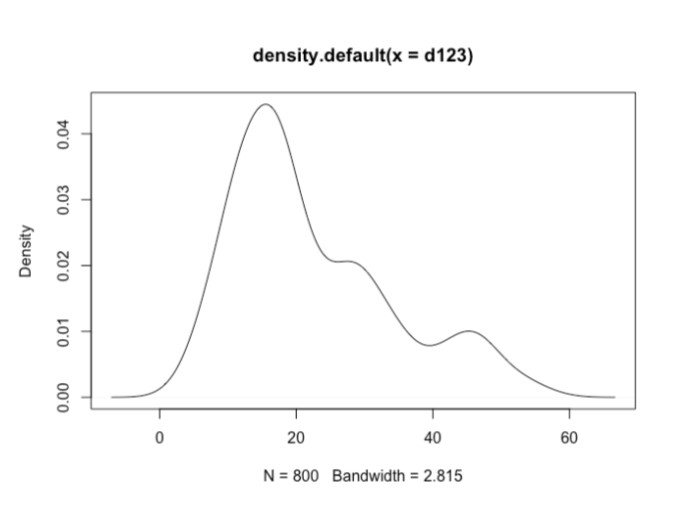

```{r setup, include=FALSE}
knitr::opts_chunk$set(echo = TRUE)
```

```{r message=FALSE, warning=FALSE}
library(tidyr)
library(reshape2)
library(ggplot2)
library(ggpubr)
set.seed(989899)
```

Person who helps me a lot: **108070013**

## Question1

Reshaping the data with a wide data frame, verizon, to a "long" data frame.

### Comparison

`tidyr` is designed specifically for tidying data instead of general reshaping (`reshape`).

Most data we observe today are in the wide form, which multiple measures of a single observation are stored in a single row.

```{r tables-verizon_wide}
# We all saw verizon data set in the wide form.
verizon_wide <- read.csv('verizon_wide.csv')
knitr::kable(head(verizon_wide))
ILEC <- na.omit(verizon_wide$ILEC)
CLEC <- na.omit(verizon_wide$CLEC)
```

The wide form of presentation does not correspond each row of value to one observation.

#### We all know that `gather()` and `melt()` function transform the data from wide form to long form.

We could easily observe that **gather()** function create the key-value pair, and usually you will need to tell **melt()** function which of your variables are id variables, and which are the variables to be measured. In the verizon's case. **melt()** function treat `the company` as an id. variable.

```{r tables-verizon}
knitr::kable(head(gather(verizon_wide)))
knitr::kable(head(melt(verizon_wide)))
```

However, you could only get the same output on data frames. As what has been shown below, **gather()** function could not work on arrays or matrices (shown error), but **melt()** function could.

```{r}
matrix_test <- matrix(rnorm(6), ncol=2); matrix_test
```

```{r}
#gather(matrix_test)
#if you transform wide data to long data using gather function, it will pop error.
```

```{r}
melt(matrix_test)
```

### Conclusion

**gather()** function in `tidyr` can only work on data frames, while **cast()** in `reshape2` can work on both matricies and arrays. Also, `reshape2` can do aggregation, but `tidyr` is not designed for the purpose.

**Note.** Tidy data is data where 1. every column is variable; 2. every row is an observation; 3. every cell is a single value. If you ensure that your data is tidy, you'll spend less time working with `tidyr`.

> -   **a.** Why you picked the reshaping package over the others?

> | **Ans.** Since *reshape2* is officially retired, only changes necessary to keep it on CRAN will be made. I will choose to use *tidyr* for transforming the wide data into a long one.

> -   **b.** Show the code to reshape the versizon_wide.csv data
>
> ```{r}
> verizon_long <- gather(verizon_wide, na.rm = TRUE,  key='Company', value = 'Time')
> ```
>
> -   **c.** Show us the `head` and `tail` of the data to show that the reshaping worked.
>
> ```{r tables-long}
> knitr::kable(head(verizon_long))
> knitr::kable(tail(verizon_long))
> ```
>
> -   **d.** Visualize Verizon's response times for ILEC vs. CLEC customers.
>
> ```{r}
> b <- "cornflowerblue"
> companies <- split(verizon_long, verizon_long$Company)
> >
> p1 <- ggplot()+aes(companies$ILEC$Time)+geom_density(col=b)
> p2 <- ggplot()+aes(companies$CLEC$Time)+geom_density(col=b)
> >
> ggarrange(p1, p2, ncol=1, nrow=2)
> >
> plot(density(companies$ILEC$Time), col=b, lwd=2, main="ILEC vs. CLEC")
> lines(density(companies$CLEC$Time), col="coral3", lwd=2)
> legend(300, 0.5, lty=1, c("ILEC", "CLEC"), col=c("coral3",b))
> ```

## Question2

Test if the mean of response times for CLEC customers is greater than for ILEC customers.

> -   **a.** State the appropriate null and alternative hypotheses (one-tailed)

> | **Ans.**

> | $H_0: μ_C <= μ_I$

> | $H_1: μ_C > μ_I$

> -   **b.** Use the `t.test()` function to test the difference between the mean of ILEC versus CLEC response times at 1% significance.
>
>     -   **i.** Conduct the test assuming variances of the two populations are equal.
>
>     ```{r}
>     # Assuming both poplations are normal
>     # Variance of two populations are the same
>     # Alternative hypothesis: CLEC > ILEC
>     >
>     t.test(CLEC, ILEC, alt='greater',var.equal = TRUE, conf.level=0.99)
>     ```
>
>     > | We state our null hypothesis as: true difference in means is greater than 0, due to the fact that our power to reject the null hypothesis is smaller than 1%, the significance level, thus we reject the null hypothesis.
>
>     -   **ii.** Conduct the test assuming variances of the two populations are not equal.
>
> ```{r}
> t.test(CLEC, ILEC, alt='greater', var.equal = FALSE, conf.level=0.99)
> ```

> | In this case, we are assuming the two populations do not have the same variance, and the p-value has a larger value than the significance level 1%, which give the hypothesis a greater power; therefore, we conclude that we can not reject the null hypothesis.

> -   **c.** Use a permutation test to compare the means of ILEC vs. CLEC response times.
>
>     -   **i.** Visualize the distribution of permuted differences, and indicate the observed difference as well.
>
>     ```{r}
>     observed_diff <- mean(CLEC)-mean(ILEC)
>     >
>     permute_func <- function(values, Groups){
>       permute <- sample(values, replace=FALSE)
>       Grouped <- split(permute, Groups)
>       permute_diff <- mean(Grouped$CLEC)-mean(Grouped$ILEC)
>     }
>     >
>     permute_diff <- replicate(10000, 
>                               permute_func(verizon_long$Time, verizon_long$Company))
>     >
>     b <- 'cornflowerblue'
>     ggplot()+
>       aes(permute_diff)+
>       geom_histogram(aes(y=..density..), binwidth = 0.7, col="black", fill=b)+
>       geom_density(fill="red", alpha=0.3)+
>       geom_vline(xintercept = observed_diff, col="red", lwd=1.2)+
>       ggtitle('Null Distribution of Differences')
>     >
>     p1_tail <- sum(permute_diff > observed_diff)/10000
>     p2_tail <- sum(abs(permute_diff)>observed_diff)/10000
>     ```
>
>     > | As we can observe from the result above, the percent of permutations where $diff > x̄_p-x̄_o$ is 0.0166, indicating that there are about 1066 out of 10000 permutations.
>
>     -   **ii.** What are the one-tailed and two-tailed p-values of the permutation test?
>
>         ```{r}
>         cat("p1: ", p1_tail, "p2: ", p2_tail)
>         ```
>
>     -   **iii.** Would you reject the null hypothesis at 1% significance in a one-tailed test?
>
>     <div>
>
>     | **Ans.** No, since the p-value is greater than the 1%.
>
>     </div>

## Question3

Let's use the Wilcoxon test to see if the response times for CLEC are different than ILEC.

> -   **a.** Compute the *W statistic* comparing the values.
>
> ```{r}
> # Wilcoxon Test
> get_eq <- function(a, b){
>   ifelse(a>b, 1, ifelse(a==b, 0.5, 0))
> }
> >
> #get_eq(5,5)
> W_1 <- sum(outer(CLEC, ILEC, FUN=get_eq))
> W_1
> >
> # Rank sum test
> time_ranks <- rank(verizon_long$Time)
> rank_group <- split(time_ranks, verizon_long$Company)
> rank_sum <- sum(rank_group$CLEC)
> n <- length(CLEC)
> W_2 <- rank_sum-(n*(n+1))/2
> identical(W_1, W_2)
> ```
>
> -   **b.** Compute the one-tailed p-value for W.
>
> ```{r}
> n1 <- length(CLEC)
> n2 <- length(ILEC)
> >
> wilcox_p1_tail <- 1-pwilcox(W_1, n1, n2)
> wilcox_p1_tail
> ```
>
> -   **c.** Run the Wilcoxon Test again using the `wilcox.test()` function in R. Show the results.
>
> ```{r}
> wilcox.test(Time~Company, data=verizon_long, alternative="greater")
> >
> # Oh my God, way faster.
> ```
>
> -   **d.** At 1% significance, and one-tailed, would you reject the null hypothesis that the values of CLEC and ILEC are different from one another?
>
>     **Ans.** Yes, since the p-value is smaller than the significance level (1%), we can conclude that we have enough evidence to reject the null hypothesis.

## Question4

One of the assumptions of some classical statistical tests is that our population data should be roughly normal. Let's explore one way of visualizing whether a sample of data is normally distributed.

> -   **a.** Follow the steps to see how a distribution of values compares to a perfectly normal distribution.
>
>     -   **i.** Create a sequence of probability numbers from 0 to 1, with \~1000 probabilities in between.
>
>         ```{r}
>         #probs1000 <- seq(0, 1, 0.001)
>         ```
>
>     -   **ii.** Calculate \~1000 quantiles of our values and name it **`q_vals`**.
>
>         ```{r}
>         #q_vals <- quantile(value, probs=probs1000)
>         ```
>
>     -   **iii.** Calculate \~1000 quantiles of a perfectly normal distribution with the same mean and standard deviation as our values; name this vector of normal quantiles **`q_norm`**.
>
>         ```{r}
>         #q_norm <- qnorm(probs1000, mean=mean(value), sd=sd(value))
>         ```
>
>     -   **iv.** Create a scatterplot comparing the quantiles of a normal distribution versus quantiles of values.
>
>         ```{r}
>         #plot(q_norm, q_vals, xlab="normal quantiles", ylab="values quantiles")
>         ```
>
>     -   **v.** Finally, draw a red line with intercept of 0 and slope of 1, comparing these two sets of quantiles.
>
>         ```{r}
>         #abline(a=0, b=1, col="red", lwd=2)
>         ```
>
> -   **b.** Confirm that your function works, and check that it looks like the plot below:
>
> 
>
> 
>
> ```{r}
> norm_qq_plot <- function(value){
>   
>   probs1000 <- seq(0, 1, 0.001)
>   
>   q_vals <- quantile(value, probs=probs1000)
>   
>   q_norm <- qnorm(probs1000, mean=mean(value), sd=sd(value))
>   
>   plot(q_norm, q_vals, xlab="normal quantiles", ylab="values quantiles")
>   abline(a=0, b=1, col="red", lwd=2)
> }
> >
> set.seed(978234)
> d1 <- rnorm(n=500, mean=15, sd=5)
> d2 <- rnorm(n=200, mean=30, sd=5)
> d3 <- rnorm(n=100, mean=45, sd=5)
> d123 <- c(d1, d2, d3)
> >
> par(mfrow=c(1,2))
> plot(density(d123))
> norm_qq_plot(d123)
> >
> # Another way doing this:
> # qqnorm(d123)
> # qqline(d123, col="blue", lwd=2)
> ```
>
> Interpret the plot you produced (Q-Q plots), and tell us if it suggests whether d123 is normally distributed or not.

```{r message=FALSE, warning=FALSE}

qq_plt <- function(data, title=""){
  
  p1 <- ggplot()+
    aes(data)+
    geom_histogram(aes(y=..density..), col="white", fill="black")+
    geom_density(col="red", lwd=1.2)+
    ggtitle("Histogram")
  
  p2 <- ggplot(data.frame(data), aes(sample=data))+
    stat_qq()+
    stat_qq_line(col=b, lwd=1.2)+
    ggtitle("Q-Q plot")+
    xlab('Theoretical Quantites')
  
  graphs <- ggarrange(p1, p2, 
                      ncol=1,
                      font.label = c(size=10),
                      common.legend = TRUE, 
                      legend="bottom")
  annotate_figure(graphs, 
                  top = text_grob(title, col="black", face="bold", size=14))
}

qq_plt(d123, "d123")
```

> | **Ans.** As we can observe from the graph presented above, despite the fact that the **histrogram** seems to be seriously right skewed, if you look at the Q-Q plot, the points gradually match the blue line as you follow the quantiles from left to right.

> | For the **Q-Q** plot, the blue line shows where the points would fall if the data set were normally distributed. Observe the points on the left hand side of the plot, they appears to occur at much higher value, meaning that there is a greater concentration of the data to the right of the Gaussian distribution. However, lines seems to match at the center of the data set, so I would suggest that d123 is overall normally distributed.

> -   **c.** Use your normal Q-Q plot function to check if the values from each of the CLEC and ILEC samples we compared in question 2 could be normally distributed. What's your conclusion?
>
> ```{r message=FALSE, warning=FALSE}
> norm_qq_plot(CLEC)
> qq_plt(CLEC, "CLEC")
> >
> norm_qq_plot(ILEC)
> qq_plt(ILEC, "ILEC")
> ```

**Ans.** I think due to the lack of data amount, we can't actually conclude anything from the histogram; however, looking at the Q-Q plot we can observe that the plot of CLEC fluctuates along the straight line, as for ILEC, the points depart upward from the straight line and never come back. Therefore, I would conclude that we can hardly say that ILEC sample is normally distributed, while CLEC may follows the Gaussian Distribution.
