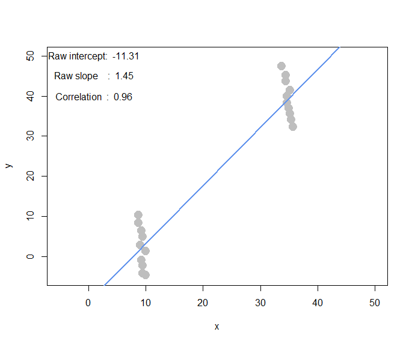

```{r setup, include=FALSE}
knitr::opts_chunk$set(echo = TRUE)
```

# BACS HW - Week 9

------------------------------------------------------------------------

## Prerequisite

```{r}
library(data.table)
bundle_dt <- fread('piccollage_accounts_bundles.csv')
bundle_m <- as.matrix(bundle_dt[,-1])
```

------------------------------------------------------------------------

## Question 1) Making an automated recommendation system for the PicCollage mobile app.

## a. Explore to see if any sticker bundles seem intuitively similar.

> #### i. Download `PicCollage` and take look at the style and content of bundles in their Sticker Store.
>
> -   How many recommendations does each bundle have?
>
>     **Ans.** 6
>
> #### ii. Find a sticker bundle that is both in our limited data set and also in the app's Sticker Store. Use your intuition to guess **5** other bundles in our dataset that might have similar usage patterns as this bundle.
>
> ```{r}
> head(colnames(bundle_dt))
> set.seed(125)
> sticker_num <- round(runif(1, 0, 166), 0)
> cat(sticker_num)
> names(bundle_dt[,137])
> ```
>
> -   **Intuition:** I'm guessing `Valentine stickers`, `happy`, `Saint Valentine`, `Heart Sticker Pack`, `Valentine 2013 Sticker Pack`
>
>     -   **Note.** I randomly choose the $137th$ sticker lies in the given bundles, which is **`cute valentine`**. However, there is no `cute valentine` in the app store, but `cute valentines`.
>
> ```{r}
> names(bundle_dt[,c(6, 18, 44, 66, 119)])
> ```

### b. Find similar bundles using geometric models of similarity.

> #### i. Cosine Similarity
>
> 1.  Create a matrix or data.frame of the top 5 recommendations for all bundles.
> 2.  Create a new function that automates the functionality: Take an accounts-bundles matrix as a parameter, and return a data object with the top **5** recommendations for each bundle in our data set, using cosine similarity.
> 3.  What are the top 5 recommendations for the bundle you chose to explore earlier?
>
> ```{r warning=FALSE}
>   library(lsa)
>   cosine_m <- cosine(bundle_m)
>   
>   # After passing a matrix into sort_names, 
>   # the function will sort each row values in a decreasing order, 
>   # and then returns a recommendation list.
>   sort_name <- function(m){
>     
>     # 1 is for checking on the values
>     total_m <- list()
>     
>     for(i in 1:length(colnames(m))){
>       temp = as.matrix(t(sort(m[i,], decreasing = TRUE)))
>       if(i==1){
>         total_m$new_m <- colnames(temp)
>         total_m$new_v <- temp
>       }else{
>       total_m$new_m <- rbind(total_m$new_m, colnames(temp))
>       total_m$new_v <- rbind(total_m$new_v, temp)
>       }
>     }
>     return(total_m)
>   }
>   
>   # this function caluculates the cosine similarity,
>   # and then pass the matric to the above sort_names function;
>   # eventually returns a recommendation list.
>   
>   recommend <- function(m, FUN='cos'){
>     
>     M <- list()
>     
>     if(FUN=='cos'){
>       c_m <- cosine(m)
>     }else if(FUN=='cor'){
>       c_m <- cor(m)
>     }
>     M$new_m <- sort_name(c_m)$new_m
>     M$corr_v <- c_m
>     row.names(M$new_m) <- colnames(cosine_m)
>     colnames(M$new_m) <- 1:length(colnames(cosine_m))
>     row.names(M$corr_v) <- colnames(cosine_m)
>     colnames(M$corr_v) <- colnames(cosine_m)
>     return(M)
>   }
>   
>   
>   new_m <- sort_name(cosine_m)$new_m
>   
>   new_v <- sort_name(cosine_m)$new_v
>   row.names(new_m) <- colnames(cosine_m)
>   colnames(new_m) <- 1:length(colnames(cosine_m))
>   
>   knitr::kable(new_m[1:3, 1:6])
> ```
>
> ### ii. Correlation
>
> 1.  Reuse the function you created above (don't change it.)
> 2.  Give the function an accounts-bundles matrix where each\
>     bundle has already been mean-centered in advance.
> 3.  Now what are the top **5** recommendations for the bundle you chose to explore earlier?
>
> ```{r}
> cosine_similarity_m <- recommend(bundle_m)$new_m
> knitr::kable(head(cosine_similarity_m['cutevalentine',]))
> cal_corr <- function(m){
>   MAX <- max(ncol(m), nrow(m))
>   bundle_means <- apply(m, 2, mean)
>   bundle_means_m <- t(replicate(nrow(m), bundle_means))
>   bundle_corr_m <- m-bundle_means_m
>   if (ncol(bundle_corr_m)==MAX) {new_m <- cosine(t(bundle_corr_m))}
>   else {new_m <- cosine(bundle_corr_m)}
>   return(new_m)
> }
> >
> bundle_cor_m <- cal_corr(bundle_m)
> knitr::kable(bundle_cor_m[1:6,1:6])
> correlation_m <- recommend(bundle_cor_m)$new_m
> correlation_v <- recommend(bundle_cor_m)$corr_v
> # Just to make sure.
> # correlation_m <- recommend(bundle_m, FUN='cor')
> >
> knitr::kable(head(correlation_m['cutevalentine',]))
> ```
>
> ### iii. Adjusted-Cosine
>
> 1.  Reuse the function you created above (don't change it.)
> 2.  Give the function an accounts-bundles matrix where each\
>     bundle has already been mean-centered in advance.
> 3.  Now what are the top **5** recommendations for the bundle you chose to explore earlier?
>
> ```{r}
> temp <- as.data.frame(bundle_dt[,-1])
> temp <- transpose(temp, keep.names = 'rn')
> row.names(temp) <- temp$rn
> temp = as.matrix(temp[,-1])
> adjust_cosine_m <- cal_corr(temp)
> knitr::kable(adjust_cosine_m[1:6,1:6])
> ad_cosine_m <- recommend(adjust_cosine_m)$new_m
> ad_cosine_v <- recommend(adjust_cosine_m)$new_v
> knitr::kable(head(ad_cosine_m['cutevalentine',]))
> ```

### Visualization

```{r}
library(corrplot)
par(mfrow=c(3,1))
corr_m <- cor(bundle_m)
corrplot(corr_m[135:145, 135:145], method='color')
corrplot(bundle_cor_m[135:145,135:145], method='color')
corrplot(correlation_v[135:145, 135:145], method='color')
```

### c. Are the 3 sets of recommendations similar in nature to the recommendations you picked earlier using your intuition alone? What reasons might explain why your recommendation models produce different results from your intuition?

-   **Ans.** No, it's not similar at all! I choose the following 5 recommendation based on the names of the sticker bundles, while my recommendation model calculates the sets based on the cosine similarity of an actual usage data.

### d. What do you think is the conceptual difference in cosine similarity, correlation, and adjusted-cosine?

-   **Ans.**

    -   **Cosine Similarity**

        Cosine similarity is a measure of similarity between two non-zero vectors of an inner product space that measures the cosine of the angle between them.

        For example, in text mining, each term is notionally assigned a different dimension and a document is characterized by a vector where the value of each dimension corresponds to the number of times that term appears in the document. Cosine similarity then gives a useful measure of how similar two documents are likely to be in terms of their subject matter.

    -   **Correlation**

        Correlation is calculated based on how much the ratings by common users for a pair of items deviate from average ratings for those items.

    -   **Adjusted-Cosine similarity**

        Adjusted cosine similarity measure is a modified form of cosine similarity where we take into account that different users have different ratings schemes; in other words, some users might rate items highly in general, and others might give items lower ratings as a preference.

-   One fundamental difference between cosine and adjusted-cosine similarity is that the former method is computed along the rows of the matrix but in case of the item-based CF the similarity is computed along the columns.

    Computing bundles similarity using basic `cosine measure` has one important drawback, the difference in rating scale between different accounts are not taken into account. The `adjusted cosine similarity` offsets this drawback by subtracting the corresponding user average from each co-rated pair.

------------------------------------------------------------------------

## Prerequisite

```{r}
if(!exists('foo',mode='function')) source("demo_simple_regression.R")
#interactive_regression()
```

------------------------------------------------------------------------

## Question 2) Correlation

### a. Create a horizontal set of random points, with a relatively narrow but flat distribution.

> #### i. What raw slope of x and y would you generally expect?
>
> -   **Ans.** Raw slope of x and y is expected to be 0.
>
> #### ii. What is the correlation of x and y that you would generally expect?
>
> -   **Ans.** Correlation is expected to be 0. (ie. No relationship is between them at all)
>
> 

### b. Create a completely random set of points to fill the entire plotting area, along both x-axis and y-axis.

> #### i. What raw slope of x and y would you generally expect?
>
> -   **Ans.** Raw slope of x and y is expected to be 0.
>
> #### ii. What is the correlation of x and y that you would generally expect?
>
> -   **Ans.** Correlation is expected to be 0. (ie. No relationship is between them at all)
>
> 

### c. Create a diagonal set of random points trending upwards at 45 degrees.

> #### i. What raw slope of x and y would you generally expect?
>
> -   **Ans.** Raw slope of x and y is expected to be 1.
>
> #### ii. What is the correlation of x and y that you would generally expect?
>
> -   **Ans.** Correlation is expected to be 1.
>
> 

### d. Create a diagonal set of random trending downwards at 45 degrees.

> #### i. What raw slope of x and y would you generally expect?
>
> -   **Ans.** Raw slope of x and y is expected to be -1.
>
> #### ii. What is the correlation of x and y that you would generally expect?
>
> -   **Ans.** Correlation is expected to be -1.
>
> 

### e. Find another pattern of data points with no correlation (r ≈ 0). (Create a pattern that visually suggests a strong relationship but produces r ≈ 0?)


### f. Find another pattern of data points with perfect correlation (r ≈ 1). (Find a scenario where the pattern visually suggests a different relationship?)



### g. Let's see how correlation relates to simple regression, by simulating any linear relationship you wish:

> #### i. Run the simulation and record the points you create: `pts <- interactive_regression():`
>
> ```{r}
> #pts <- interactive_regression()
> ```
>
> 
>
> #### ii. Use the `lm()` function to estimate the regression intercept and slope of pts to ensure they are the same as the values reported in the simulation plot: `summary( lm( pts$y ~ pts$x ))`
>
> ```{r}
> #summary(lm(pts$y ~ pts$x))
> ```
>
> | Min     | 1Q      | Median | 3Q     | Max    |
> |---------|---------|--------|--------|--------|
> | -17.235 | -12.249 | -7.866 | 11.708 | 330821 |
>
> : Residuals
>
> |               | Estimate | **Std Err** | t value | prob($>|t|$) |
> |---------------|----------|-------------|---------|--------------|
> | **Intercept** | 3.015    | 3.619       | 0.833   | 0.407        |
> | **pts\$x**    | 0.479    | 0.108       | 4.442   | 0            |
>
> : Coefficients
>
> |                             |       |
> |-----------------------------|-------|
> | **Residual Standard Error** | 15.34 |
> | **Multiple R-squared**      | 0.196 |
> | **Adjusted R-squared**      | 0.186 |
> | **F-statistic**             | 19.73 |
> | **Degree of Freedom**       | 81    |
> | **p-value**                 | 0     |
>
> #### iii. Estimate the correlation of x and y to see it is the same as reported in the plot: `cor(pts)`
>
> ```{r}
> #cor(pts)
> ```
>
> |       |       |       |
> |-------|-------|-------|
> |       | **x** | **y** |
> | **x** | 1     | 0.443 |
> | **y** | 0.443 | 1     |
>
> : Correlation of `x` and `y`
>
> #### iv. Now, standardize the values of both `x` and `y` from `pts` and re-estimate the regression slope.
>
> ```{r}
> #standardize <- function(v){
>   #diff <- v - mean(v)
>   #std <- sd(v)
>   #return(diff/std)
> #}
> >
> #standardized_df <- data.frame(x=standardize(pts$x),
>  #                             y=standardize(pts$y))
> >
> #knitr::kable(standardized_df)
> ```
>
> -   **Thoughts:** I'm guessing that the regression slope wouldn't change.
>
>     |         |        |            |        |         |
>     |---------|--------|------------|--------|---------|
>     | **Min** | **1Q** | **Median** | **3Q** | **Max** |
>     | -1.014  | -0.72  | -0.462     | 0.689  | 1.9891  |
>
>     : Residuals
>
>     +------------------------+--------------+-------------+-------------+----------------------+
>     |                        | **Estimate** | **Std Err** | **t value** | **Prob(**$>|t|$**)** |
>     +------------------------+--------------+-------------+-------------+----------------------+
>     | **Interception**       | 0            | 0           | 0           | 1                    |
>     +------------------------+--------------+-------------+-------------+----------------------+
>     | **Standardized_df\$x** | 0            | 0           | 4.442       | 0                    |
>     +------------------------+--------------+-------------+-------------+----------------------+
>
>     : Coefficients
>
> |                             |       |
> |-----------------------------|-------|
> | **Residual Standard Error** | 0.902 |
> | **Multiple R-squared**      | 0.196 |
> | **Adjusted R-squared**      | 0.186 |
> | **F-statistic**             | 19.73 |
> | **Degree of Freedom**       | 81    |
> | **p-value**                 | 0     |
>
> |       | **x** | **y** |
> |-------|-------|-------|
> | **x** | 1     | 0.443 |
> | **y** | 0.443 | 1     |
>
> : Correlation of `x` and `y`
>
> #### v. What is the relationship between correlation and the standardized simple-regression estimates?
>
> ```{r}
> #summary(lm(standardized_df$y ~ standardized_df$x))
> #cor(standardized_df)
> ```
>
> **Ans.** The correlation values do not change.
